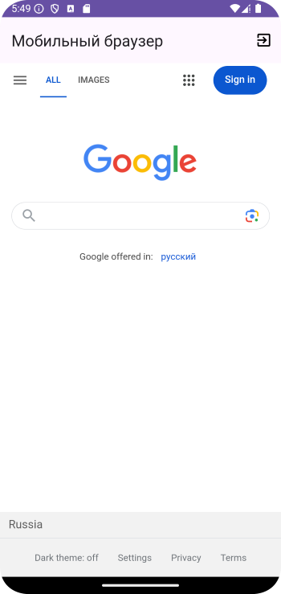

# Домашнее задание по теме "WebView, GridView, CardView"

## Приложение «Мобильный браузер»

Необходимо написать приложение, состоящее из нескольких экранов. На первом располагается **GridView** с корневым элементом **CardView** (аналогично модели на занятии). Каждый элемент представляет собой картинку и заголовок той страницы интернета, на которую по нажатию будем переходить. Допустим, yandex, gismeteo и т.д. (страницы браузера выбрать по своему усмотрению). По нажатию на элемент такого списка переходим на соответствующую страницу в интернете. В приложении есть **Toolbar** с пунктом меню выхода.

Для работы приложения необходимо создать:

На первом экране:

1. **Toolbar** с заголовком **«Мобильный браузер»**.
2. **GridView** с корневым элементом **CardView**.
3. Меню с пунктом **«Exit»**.

На втором экране:

1. **Toolbar** с заголовком **«Мобильный браузер»**.
2. **WebView** для просмотра страницы интернета.
3. Меню с пунктом **«Exit»**.

Приложение необходимо сохранить проектом в удаленном репозитории, для проверки качества предоставить ссылку преподавателю, либо сделать видео экрана реального устройства в процессе работы приложения.

# Скриншоты к домашнему заданию по теме "WebView, GridView, CardView"

 Скриншоты здесь 

